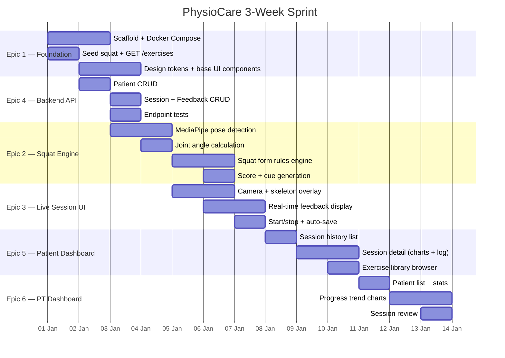

# PhysioCare — Hackathon Prototype Roadmap

**Timeline:** 3 weeks | **Primary Exercise:** Squat | **Auth:** Out of scope

---

## Execution Order (Recommended)

> **Note:** Dates are relative from Day 1. Adjust to actual start date.

---

## Epics Overview

| # | Epic | US Count | Task Count | Risk | Track |
|---|---|---|---|---|---|
| 1 | Foundation | 3 | 10 | Low | Fullstack |
| 2 | Squat Exercise Engine | 4 | 14 | Medium | Frontend |
| 3 | Live Session UI | 3 | 9 | Medium | Frontend |
| 4 | Backend API + DB | 4 | 12 | Low | Backend |
| 5 | Patient Dashboard | 3 | 9 | Low | Frontend |
| 6 | PT Dashboard | 3 | 8 | Low | Frontend |
| | **Total** | **20** | **61** | | |

---

## Key Decisions

- **No auth** — patient/PT selection via dropdown (simplifies scope)
- **Squat only** — other exercises added only after approval
- **MediaPipe tasks-vision** — 100% on-device, no cloud cost
- **SQLite** — sufficient for prototype, swap to PostgreSQL for prod
- **FastAPI auto-docs** — OpenAPI serves as endpoint documentation

---

## Risk Hotspots

1. **MediaPipe WASM loading** — test on lower-end devices early
2. **Squat form rules tuning** — may need iterative calibration
3. **Canvas performance** — ~30fps skeleton overlay on 720p video
4. **3-week deadline** — prioritize core loop: camera → detect → score → save

---

## Artifacts

All kanban cards and task cards are in `.physiocare-agent/ai/artifacts/<Epic>/`.