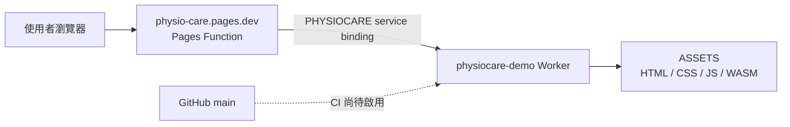

# Cloudflare 部署指南：固定 Pages 網址＋團隊管理 Worker

本文件是隊友及 AI agent 的部署操作入口。最後核對：2026-10-07（香港時間）。舊交接報告只作歷史證據；執行部署前，仍須查目前 Git、Cloudflare 版本及權限。

## 1. 目前狀態與入口

| 項目 | 設定／狀態 |
| --- | --- |
| 公開網站 | https://physio-care.pages.dev |
| GitHub repo | https://github.com/Brian-storm/Physio-Care-Web-Mobile |
| 部署 PR | https://github.com/Brian-storm/Physio-Care-Web-Mobile/pull/3 （最後核對時未合併） |
| Pages 專案 | `physio-care`；只提供 gateway，由 owner 管理 |
| App Worker | `physiocare-demo`；日常網站更新部署到這裡 |
| 前端 | Next.js 14 static export，輸出 `frontend/out` |
| 後端 | FastAPI 程式保留在 repo，但未部署、未接通前端 |
| 資料 | 預載 synthetic fixtures；即時鏡頭數值不會寫入資料庫 |
| 隊友 Cloudflare 邀請 | 等待私下提供及確認 Cloudflare 登入電郵 |
| GitHub Actions | workflow 已寫好；尚待合併、設定 credentials 及首次 CI 驗證 |

**現有公開網站可用，不代表隊友已取得權限或 CI 已啟用。** 截至上述日期，没有新增或分享部署 Token。

## 2. 架構與權限邊界



- Pages 透過固定的 Service Binding 轉交全部 path、query、method 和 body；它不是重新導向，所以瀏覽器網址不變。
- Pages 不存放 app 的靜態副本。Worker 更新後，固定網址會讀取新版；正常 release 不需重新部署 Pages。
- App Worker 只有自己的 `ASSETS` binding，沒有其他專案的資料庫、服務、storage 或 secrets。
- Gateway 不持有 Cloudflare 管理 API Token，也不接受使用者指定上游網址；它只呼叫固定的 `PHYSIOCARE` binding。
- 上游錯誤會回傳不快取的 HTTP 503；正常回應的狀態碼、body、cache headers 與 COOP/COEP 會保留。
- Pages Functions 請求會使用 Workers quota。GitHub 公開 repo 使用標準 Ubuntu runner 的運算免費，但不能把 Cloudflare gateway 流量當成純靜態免費請求。

## 3. 必讀檔案與指令對照

以下路徑均相對 repo root。

| 檔案 | 用途 |
| --- | --- |
| `frontend/wrangler.worker.jsonc` | App Worker 名稱、entrypoint、assets binding |
| `frontend/worker/index.js` | 把 request 交给 `env.ASSETS.fetch` |
| `frontend/gateway/wrangler.toml` | Owner 管理的 Pages 專案與 service binding |
| `frontend/gateway/public/_worker.js` | Pages gateway，保留 upstream response |
| `frontend/gateway/public/_routes.json` | 全部 path 經 gateway，沒有排除項 |
| `frontend/gateway/tests/gateway.test.mjs` | HTTP forwarding、binary、HEAD/404、503 測試 |
| `frontend/scripts/build-cloudflare.mjs` | Next static export；產生 `deployment.json` |
| `frontend/scripts/prepare-pose-assets.mjs` | 從 lockfile 對應套件複製 MediaPipe WASM |
| `frontend/public/_headers` | Worker assets 的隔離及基本 response headers |
| `.github/workflows/cloudflare-pages.yml` | 名稱雖保留 pages，實際只部署 Worker |
| `docs/cloudflare-gateway-verification.json` | 歷史線上驗證；不是最新部署狀態 |

| 在 `frontend` 執行 | 效果 |
| --- | --- |
| `npm run build:cloudflare` | 只建置，不部署 |
| `npm run test:gateway` | 只跑 gateway tests |
| `npm run preview:cloudflare` | 建置後本機預覽 Worker |
| `npm run preview:gateway` | 本機同時啟動 gateway＋Worker；先建置 |
| `npm run deploy:worker` | 建置並部署 App Worker；會影響公開網站 |
| `npm run deploy:cloudflare` | 同 `deploy:worker` |
| `npm run deploy:gateway` | 只部署 Pages gateway；owner 操作 |

**不要把 `frontend/out` 直接部署到 Pages，否則會把 gateway 換成靜態 snapshot。不要為了部署本網站建立同名新 Worker、改其他專案、加全帳戶權限或修改網域。**

## 4. 本機準備與 credential 設定

使用 Node.js 22 和 npm。Wrangler 由 `frontend/package-lock.json` 鎖定；不必另裝全域版本。

```sh
# 在 repo root
cd frontend
npm ci
npm run test:gateway
npm run build:cloudflare
```

部署前，需要由 owner 私下提供／確認：

| 名稱 | 在哪裡提供 | 說明 |
| --- | --- | --- |
| `CLOUDFLARE_ACCOUNT_ID` | 本機環境變數、GitHub repository Secret | 不是密鑰，但本專案選擇不在公開檔案刊登 |
| `CLOUDFLARE_API_TOKEN` | 本機環境變數 | Wrangler 讀取的 credential，僅使用獲授權的 scoped Token |
| `PHYSIOCARE_WORKER_API_TOKEN` | GitHub repository Secret | CI 專用；workflow 會映射為 Wrangler 的 `CLOUDFLARE_API_TOKEN` |
| Cloudflare 登入電郵 | 私下交給 owner | 用來邀請成員，不放 GitHub issue、PR、docs 或 screenshots |

取得憑證後，可透過 password manager 注入環境變數。若在 Bash／zsh 的私人終端輸入 Token，可使用隱藏輸入（不要在 AI 工具輸出中展示內容）：

```sh
export CLOUDFLARE_ACCOUNT_ID='<由 owner 私下提供的 account ID>'
# 下一行會等待輸入 Token；貼上後按 Enter，不會顯示字元。
read -r -s CLOUDFLARE_API_TOKEN
export CLOUDFLARE_API_TOKEN
```

不要將真實 Token 寫成 command argument、`echo`、shell history 或 tracked `.env.example`。`.env.*`／`.dev.vars*` 在本 repo 被忽略，但仍應用 `git check-ignore` 確認，且避免將 credential 放入前端 `NEXT_PUBLIC_*` 變數。Node build 所讀取的 public variables 可以進入瀏覽器 bundle。

`wrangler login` 是 owner 可用的互動式 OAuth 路徑，但官方指出它不支援 granular authorization。隊友不能以 owner 的 OAuth Token 代替 scoped Token。邀請本身也不保證 CLI 已有適合部署的 credential。

## 5. 隊友授權（owner 操作，尚待完成）

1. 私下收集每位隊友真正用於 Cloudflare 的電郵，不推測 GitHub email 就是 Cloudflare email，也不用 GitHub noreply 地址。
2. 在 Cloudflare 成員／permission policy 設定選 **Individual Workers → physiocare-demo → Editor**。
3. 檢查有效權限沒有其他帳戶、Developer Platform 全域角色、其他 Worker 或 Pages 管理範圍。
4. 專用部署 Token 同樣只限定這個已存在的 Worker；如 UI／API 無法提供此 scope，停下請 owner 檢查，不以 account-wide token 取代。
5. 在隊友帳戶及 scoped Token 下執行一次實際部署，確認網站可更新，且未取得其他專案管理權限。這項驗證目前未完成。

成員邀請、Token 建立或發送須取得 owner 對實際收件人及權限的授權。不要自行猜測收件人，或把私人 credential 分享到公開 repo。角色名稱／介面可能變動，請以官方文件及當時 dashboard 為準。

## 6. 日常手動 release（隊友）

從已 review 的分支／commit 開始。先確定沒有不明 local modifications，再記下 rollback version：

```sh
# 在 repo root
git status --short
git rev-parse HEAD
cd frontend
npx wrangler deployments list --config wrangler.worker.jsonc
npx wrangler versions list --config wrangler.worker.jsonc
npm ci
npm run test:gateway
npm run build:cloudflare
npx wrangler deploy --config wrangler.worker.jsonc --dry-run
```

核對輸出中的 Worker 名稱 `physiocare-demo`、只有 `ASSETS` binding、沒有非預期 secrets／bindings。所有檢查通過後才執行真正部署：

```sh
npx wrangler deploy --config wrangler.worker.jsonc
```

記下回傳的版本 UUID，完成第 8 節驗證。不要把 CLI 原始輸出直接貼入公開 repo：它可能包含 owner-specific 網址、帳戶名稱或 email。

`out/deployment.json` 的 `commit` 是建置時的 HEAD，`builtAt` 是 UTC 時間。它目前不包含 dirty flag；因此 dirty working tree 的建置不能單靠此檔宣稱與 commit 完全一致。Release 應從乾淨且已 review 的 commit 建置。

## 7. GitHub Actions 啟用與團隊流程

以下條件全部達成才算啟用：

- PR #3／其後部署修訂已 review 並合併到 `main`。
- GitHub repository Actions Secrets 已設定 `PHYSIOCARE_WORKER_API_TOKEN` 和 `CLOUDFLARE_ACCOUNT_ID`，值由 owner 私下提供。
- 專用 Token 的 Worker scope 已驗證；不使用 account-wide Pages Token。
- GitHub Actions 可以執行，且第一次真實 workflow＋網站驗證成功。

日常流程：feature branch → PR review → merge main → 自動 build／test／部署 Worker → 檢查 run 及網站。觸發條件是 `main` 的 `frontend/**` 或 workflow 檔案變動；只有 docs 變動不會部署。也可在 Actions 手動 Run workflow，分支選 `main`。其他分支及 pull request event 不會發布正式站。

Workflow 使用標準 `ubuntu-latest`、Node 22、`npm ci`，先 gateway tests 再 static build；credential 只在檢查／部署步驟注入。GitHub 權限為 `contents: read`，最多執行 15 分鐘，production deployments 串行化。未保存大型 artifact/cache。

即使 Secret 不可直接讀出，有能力更改 workflow 的人仍可能使用它。因此 scope 必須限於 PhysioCare Worker，並只給可信任隊友 repository write 權限。不要用更寬 scope 解決 403。

## 8. 部署後驗證

```sh
curl -fsSI https://physio-care.pages.dev/
curl -fsSI https://physio-care.pages.dev/patient/session/demo-session-004/live
curl -fsSI https://physio-care.pages.dev/wasm/vision_wasm_internal.wasm
curl -fsS https://physio-care.pages.dev/deployment.json
curl -sS -o /dev/null -w '%{http_code}\n' https://physio-care.pages.dev/missing-page
```

期望：正常頁面 HTTP 200；WASM `Content-Type: application/wasm`；有 `X-PhysioCare-Gateway: worker-service-v1`、COOP `same-origin`、COEP `require-corp`；不存在的 path 為 404。`deployment.json` 應與本次 `out/deployment.json` 相同。公開 GET／HEAD 檢查不需要 Token，請勿傳 Authorization header。

再用瀏覽器測試首頁 → 患者 → 結果及治療師頁，確認 URL 一直是 `physio-care.pages.dev`，沒有 asset／hydration error。鏡頭及 MediaPipe 還需要真實裝置授權、模型下載和真人動作測試；單純 HTTP 200 不代表動作分析準確。

若要證明只更新 Worker 即生效，由 owner 在更新前後記錄 Pages production deployment ID，應保持不變，而 `/deployment.json` 反映本次 build。過往已做過這項測試，但每次 release 仍需檢查當時狀態。

## 9. Gateway 修改與回滾（owner）

只有 gateway 程式、binding 或路由設定變動時才需要重部署 Pages。先測試，先發 preview，再測正式：

```sh
# frontend，已載入 owner 自己的授權環境；不要交給隊友 account-wide Pages credential
npm run test:gateway
npm run build:cloudflare
npm run preview:gateway
# 停止本機 preview 後，另在 frontend/gateway 執行
cd gateway
../node_modules/.bin/wrangler pages deploy --project-name physio-care --branch gateway-preview
# 從工具回傳的 preview URL 完成 HTTP／browser 驗證後
cd ..
npm run deploy:gateway
```

Pages deploy 必須從 gateway 目錄載入其 canonical `wrangler.toml`。不要把 custom `--config gateway/wrangler.toml` 路徑傳給 `pages deploy`：所測版本不支援。Local combined dev 則使用兩個明確 `-c`，`preview:gateway` 已處理。

### Worker 回滾

從部署前記錄的已知良好 UUID 選擇，避免回到不支援 gateway 的版本：

```sh
# frontend
npx wrangler versions list --config wrangler.worker.jsonc
npx wrangler rollback <已核實的良好版本UUID> --config wrangler.worker.jsonc
```

回滾後再做第 8 節驗證。不要假設「上一個版本」必然是要回復的版本。

### Pages 回滾

Owner 在 Cloudflare Pages → physio-care → Deployments 選已知良好的 production deployment 回滾。過往靜態站版本 `c80127d7-7215-4ee8-862f-f2287703a803` 可作緊急參考，但須先確認仍存在；回復它會停用 gateway，網站不再隨 Worker 更新。優先回復良好的 gateway deployment，並核對 service binding。

## 10. 常見問題

| 症狀 | 先檢查 |
| --- | --- |
| 403／authentication error | Token 有效期、private Account ID、指定 Worker scope；不要擴權硬試 |
| Gateway HTTP 503 | PHYSIOCARE binding 是否存在、Worker 是否可用；owner 檢查 Pages config／logs |
| 頁面可開但沒有 gateway header | 是否誤把 app 直接部署到 Pages，或正在看舊 deployment |
| WASM 404／初始化失敗 | build 是否複製 installed package 的 WASM，COOP/COEP 是否完整；Google model download 是否成功 |
| CI 沒有啟動 | PR 是否已合併、分支是否 main、是否只有 docs 變動、Actions 是否啟用 |
| CI credential check 失敗 | 兩個 repository Secret 是否設定；不要把值貼到 log／issue |
| CLI 使用者權限不足 | 邀請是否接受、是否真的登入正確帳戶、是否使用支援 granular authorization 的 Token |
| 新患者／session URL 404 | Demo 只 export fixtures 的 ID；這不代表後端壞了 |
| Worker 更新後頁面仍舊 | 比對 deployment.json、Pages production ID、gateway header，再檢查瀏覽器 cache |

此原型沒有登入、真正病人儲存或後端 health API；`/api/v1/patients` 404 是目前預期。不要以文件為由額外部署 FastAPI／D1／Supabase。

## 11. 公開 repo 的私隱規則

公開可保留：公共 Pages 網址、repo／PR 連結、Worker/Pages/service binding 名稱、版本 UUID、sanitized HTTP 狀態與 hash。團隊 Google Doc 連結經 owner 同意保留，其實際存取仍受 Google 分享設定控制。

不要刊登：學號／個人帳戶 hostname、Cloudflare Account ID、登入電郵、API/OAuth Tokens、私人 `.env`、授權 headers、未清理的 dashboard/CLI logs、真實病人資料或鏡頭畫面。Account ID 本身不是 credential，本專案仍把它當 private operational metadata 管理。

CodeGraph DB 只在本機產生，見 [CodeGraph 指南](codegraph.md)。只提交 `.codegraph/.gitignore`，不提交資料庫／daemon／logs／exports。

本次清理只改目前檔案，不改寫 Git 歷史。先前提交可能仍含被移除的個人 metadata；如要移除歷史／PR 記錄，須另外取得 owner 與 repo 維護者同意。這不等於 Token 外洩，亦沒有更改雲端網址或關閉服務。

## 12. 官方參考

- [Pages Service bindings](https://developers.cloudflare.com/pages/functions/bindings/#service-bindings)
- [Worker granular roles／Pages 與 Worker 權限差異](https://developers.cloudflare.com/workers/authorization/workers/)
- [Wrangler Worker commands](https://developers.cloudflare.com/workers/wrangler/commands/workers/)
- [Pages Functions 計費](https://developers.cloudflare.com/pages/functions/pricing/)
- [GitHub Actions 計費](https://docs.github.com/en/billing/concepts/product-billing/github-actions)
