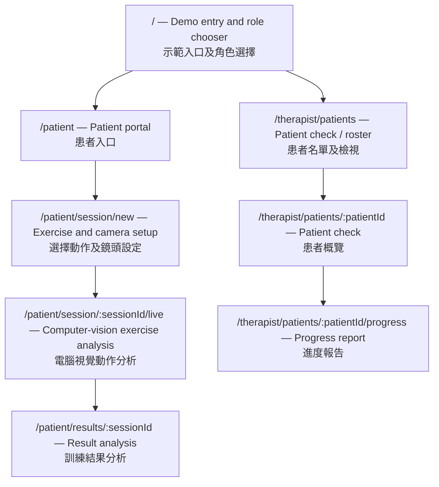
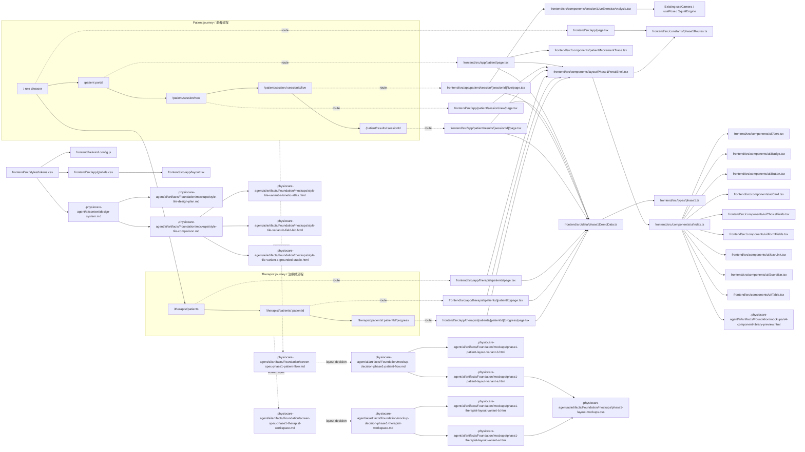
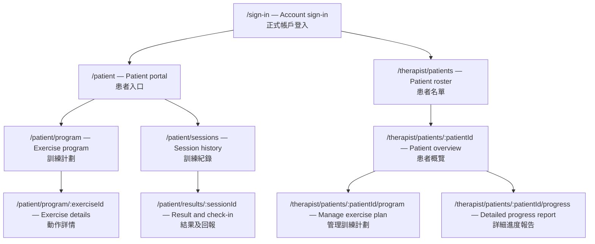
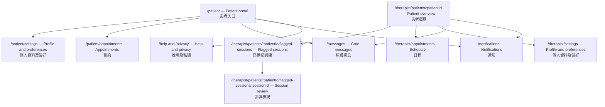

# PhysioCare — Phased Sitemap / 分階段網站地圖

## Goal / 目標

Keep the hackathon build focused on one complete care loop: a patient completes a camera-guided exercise, reviews the result, and a physiotherapist checks the patient and their progress. Reuse and extend the existing squat-analysis demo as the Phase 1 exercise-analysis experience.

黑客松版本聚焦於一個完整照護流程：患者完成鏡頭動作分析並檢視結果，物理治療師查看患者及其進度。第一階段沿用並擴充現有深蹲分析示範。

## Phase 1 — Hackathon MVP / 黑客松最小可行產品

> **Implementation status / 實作狀態 (2026-10-05):** The Phase 1 frontend demo routes and linked synthetic-data journey are implemented. Live camera analysis reuses the existing on-device squat analyzer. Authentication, backend API wiring, and session persistence are not implemented.
>
> **實作狀態 (2026-10-05)：** 第一階段前端示範路徑及虛構資料流程已完成；即時鏡頭分析沿用現有裝置端深蹲分析器。登入驗證、後端 API 串接及訓練紀錄保存尚未實作。

### Judge-facing product story / 評審展示主線

Show one continuous care loop—not a collection of screens: **a patient exercises at home → PhysioCare measures movement and captures how the session felt → their physiotherapist sees progress and knows what may need follow-up.** Use one demo patient with a goal and several seeded past sessions so the progress report is meaningful immediately; the live session itself should use the real camera analysis.

展示一個連貫的照護流程，而非一組互不相關的頁面：**患者在家訓練 → PhysioCare 測量動作並記錄訓練感受 → 物理治療師查看進度並了解是否需要跟進。** 使用一位具備訓練目標及數筆預置歷史紀錄的示範患者，讓進度報告一開始便有意義；即時訓練則使用真正的鏡頭分析。

1. **Patient context:** Show the patient's goal, prescribed/demo target, and recent trend before starting. / **患者情境：** 開始前展示患者目標、指定／示範訓練目標及近期趨勢。
2. **Live proof:** Demonstrate on-device pose tracking, rep counting, joint-angle/form feedback, and a safety cue during the exercise. / **即時成果：** 示範裝置端姿勢追蹤、次數計算、關節角度／動作品質回饋及訓練中的安全提示。
3. **Patient outcome:** Show the completed session's measures and a brief pain/discomfort check-in, compared with the seeded baseline. / **患者結果：** 展示本次訓練數據、簡短疼痛／不適回報，以及與預置基準的比較。
4. **Therapist value:** Open the same patient's report to see adherence, movement trends, and flagged sessions that merit human review. / **治療師價值：** 開啟同一患者的報告，查看訓練依從性、動作趨勢及需要人工檢視的已標記訓練。

### Sitemap / 網站地圖

Legend / 狀態：✅ Frontend demo implemented / 前端示範已完成 · ◐ Partial or fixture-only / 部分完成或僅使用示範資料 · ☐ Not implemented / 尚未實作

| Page / 頁面 | Phase 1 scope / 第一階段範圍 | Status / 狀態 |
|---|---|---|
| `/` — Entry / 入口 | Role chooser links to patient and physiotherapist demo workspaces. / 角色選擇頁連結至患者及治療師示範工作區。 | ✅ Implemented; demo routing only, no authentication. / 已完成；僅示範導覽，沒有登入驗證。 |
| `/patient` — Patient portal / 患者入口 | Shows the synthetic patient's goal, exercise target, recent trend, and **Start exercise** action. / 顯示虛構患者目標、訓練目標、近期趨勢及「開始訓練」操作。 | ✅ Implemented with frontend fixtures. / 已完成，使用前端示範資料。 |
| `/patient/session/new` — Setup / 設定 | Shows the fixed demo exercise, instructions, and on-device privacy note; camera permission is requested on the live route. / 顯示固定示範動作、指引及裝置端私隱說明；鏡頭權限在即時分析頁請求。 | ◐ Setup screen implemented; no exercise selection or live readiness preview. / 設定頁已完成；尚無動作選擇或即時準備預覽。 |
| `/patient/session/:sessionId/live` — Exercise analysis / 動作分析 | Reuses the live camera pose overlay, rep/set count, joint angles, form/danger feedback, and safety cue. / 沿用即時鏡頭姿勢疊圖、次數／組數、關節角度、動作品質／風險回饋及安全提示。 | ◐ Live analysis implemented; no pause or persistence, and result link opens a preloaded sample. / 即時分析已完成；尚無暫停或資料保存，結果連結開啟預載示範紀錄。 |
| `/patient/results/:sessionId` — Result analysis / 結果分析 | Shows fixture reps/sets, form and danger scores, duration, prior-session comparison, and pain-score context. / 顯示示範次數／組數、動作品質及風險分數、時間、前次比較及疼痛分數脈絡。 | ◐ Result view implemented; pain value is fixture-only, not an interactive or saved check-in. / 結果頁已完成；疼痛數值僅為示範資料，並非可提交或保存的回報。 |
| `/therapist/patients` — Patient check / 患者檢視 | Shows the demo patient and latest activity; opens the patient overview. / 顯示示範患者及最近活動，並可開啟患者概覽。 | ◐ Implemented with one synthetic patient; no search or API list. / 已完成，使用一位虛構患者；沒有搜尋或 API 名單。 |
| `/therapist/patients/:patientId` — Patient overview / 患者概覽 | Shows goal, latest session, status/flag, and link to the progress report. / 顯示目標、最近訓練、狀態／標記及進度報告連結。 | ✅ Implemented with frontend fixtures. / 已完成，使用前端示範資料。 |
| `/therapist/patients/:patientId/progress` — Progress report / 進度報告 | Shows fixture history, form/danger trends, pain values, totals, and flagged sessions for therapist review. / 顯示示範紀錄、動作品質／風險趨勢、疼痛數值、總量及供治療師檢視的標記事項。 | ◐ Implemented as a static report; no API aggregation or saved sessions. / 已完成靜態報告；尚無 API 彙總或保存訓練紀錄。 |

### Phase 1 essentials / 第一階段必要配套

- ✅ Role-aware demo navigation is implemented; ☐ real authentication and authorization remain unimplemented.
- ✅ One fictional patient, goal, exercise, and four historical session fixtures provide an immediate progress story.
- ☐ Session dates, measures, pain reports, and flags are not persisted; all portal/report values come from frontend fixtures.
- ✅ Camera errors are shown with a return path; ◐ permission/readiness is handled on the live route, not during setup preview.
- ✅ Feedback is labeled as measurement/safety information for therapist review, not diagnosis or treatment prescription.

第一階段配套狀態：✅ 按角色顯示示範導覽；☐ 尚無真實登入與權限；✅ 預置一位虛構患者、目標、動作及四筆歷史紀錄；☐ 尚未保存訓練日期、測量、疼痛回報或標記；✅ 鏡頭錯誤有提示及返回路徑，◐ 權限／就緒檢查在即時頁處理；✅ 回饋標示為供治療師檢視的測量／安全資訊，不作診斷或處方。

### Phase 1 file inventory / 第一階段檔案清單

Paths are repository-relative. **New** marks a file created for this Phase 1 frontend; **Updated** marks a shared existing file adapted for it. Every Phase 1 route and supporting UI/design artifact is listed individually.

以下路徑皆相對於 repository root。**新增**代表第一階段前端新增的檔案；**更新**代表配合第一階段修改的共用檔案。下表逐一列出第一階段路徑及支援介面／設計檔案。

#### Route page files / 路由頁面檔案

| File / 檔案 | Route / 路徑 | Purpose / 用途 |
|---|---|---|
| `frontend/src/app/page.tsx` — Updated | `/` | Role chooser and product entry; links to both demo workspaces. / 角色選擇及產品入口，連結至兩個示範工作區。 |
| `frontend/src/app/patient/page.tsx` — New | `/patient` | Patient portal with goal, recent trend, and exercise entry. / 患者入口，顯示目標、近期趨勢及開始訓練入口。 |
| `frontend/src/app/patient/session/new/page.tsx` — New | `/patient/session/new` | Fixed demo exercise, preparation instructions, and privacy note. / 固定示範動作、訓練準備指引及私隱說明。 |
| `frontend/src/app/patient/session/[sessionId]/live/page.tsx` — New | `/patient/session/:sessionId/live` | Route wrapper for the existing on-device squat analysis. / 現有裝置端深蹲分析的路由包裝頁。 |
| `frontend/src/app/patient/results/[sessionId]/page.tsx` — New | `/patient/results/:sessionId` | Fixture-based movement measures, comparison, and pain-score context. / 使用示範資料顯示動作測量、比較及疼痛分數脈絡。 |
| `frontend/src/app/therapist/patients/page.tsx` — New | `/therapist/patients` | Synthetic patient roster and latest activity. / 虛構患者名單及最近活動。 |
| `frontend/src/app/therapist/patients/[patientId]/page.tsx` — New | `/therapist/patients/:patientId` | Patient goal, latest session, and follow-up signal. / 患者目標、最近訓練及跟進訊號。 |
| `frontend/src/app/therapist/patients/[patientId]/progress/page.tsx` — New | `/therapist/patients/:patientId/progress` | Fixture-based trend and session history report. / 使用示範資料呈現趨勢及訓練紀錄。 |

#### Shared frontend files / 共用前端檔案

| File / 檔案 | Purpose / 用途 |
|---|---|
| `frontend/src/components/layout/Phase1PortalShell.tsx` — New | Shared role-aware demo header and route navigation. / 共用角色導覽示範頁首及路徑導覽。 |
| `frontend/src/components/patient/MovementTrace.tsx` — New | Token-based movement-path illustration for patient context. / 患者情境使用的 token 化動作路徑示意圖。 |
| `frontend/src/components/session/LiveExerciseAnalysis.tsx` — New | Camera, pose overlay, rep counting, angles, form/danger measures, and live safety signal; reuses existing hooks and engine. / 鏡頭、姿勢疊圖、次數、角度、動作品質／風險測量及即時安全提示；沿用既有 hooks 與 engine。 |
| `frontend/src/constants/phase1Routes.ts` — New | Route builders and demo patient/session identifiers. / 路徑建構函式及示範患者／訓練識別碼。 |
| `frontend/src/data/phase1DemoData.ts` — New | Synthetic patient, exercise, four sessions, progress summary, and lookup/date helpers. / 虛構患者、動作、四筆訓練、進度摘要及查找／日期工具。 |
| `frontend/src/types/phase1.ts` — New | Strict frontend-only role, patient, exercise, session, and report types. / 嚴格型別定義：角色、患者、動作、訓練及報告。 |
| `frontend/src/components/ui/Alert.tsx` — New | Semantic inline status and safety messages. / 語意化狀態及安全提示。 |
| `frontend/src/components/ui/Badge.tsx` — New | Text-plus-color status labels. / 文字加語意色彩的狀態標籤。 |
| `frontend/src/components/ui/Button.tsx` — New | Token-based button variants and interaction states. / token 化按鈕樣式及互動狀態。 |
| `frontend/src/components/ui/Card.tsx` — New | Selective plain, subtle, or raised content surfaces. / 可選平面、柔和或浮起的內容表面。 |
| `frontend/src/components/ui/ChoiceFields.tsx` — New | Accessible checkbox and radio controls. / 可及性核取方塊及單選控制項。 |
| `frontend/src/components/ui/FormFields.tsx` — New | Labeled input/select fields with help, error, and disabled states. / 含標籤、說明、錯誤及停用狀態的輸入／選擇欄位。 |
| `frontend/src/components/ui/NavLink.tsx` — New | Accessible current-page navigation link. / 可及性目前頁面導覽連結。 |
| `frontend/src/components/ui/ScoreBar.tsx` — New | Accessible 0–100 measurement bar with visible value. / 可及性 0–100 測量條並顯示數值。 |
| `frontend/src/components/ui/Table.tsx` — New | Responsive semantic table primitives. / 響應式語意表格基礎元件。 |
| `frontend/src/components/ui/index.ts` — New | Named exports for the shared UI components. / 共用 UI 元件具名匯出。 |
| `frontend/src/styles/tokens.css` — New | Kinetic Atlas color, type, spacing, surface, and motion tokens. / Kinetic Atlas 色彩、字體、間距、表面及動效 token。 |
| `frontend/src/app/globals.css` — Updated | Imports tokens and sets shared page typography/surfaces. / 匯入 token 並設定共用頁面字體／表面。 |
| `frontend/src/app/layout.tsx` — Updated | Sets Traditional Chinese locale and shared document layout. / 設定繁體中文語系及共用文件版面。 |
| `frontend/tailwind.config.js` — Updated | Maps semantic Tailwind utilities to the token source. / 將 Tailwind 語意 class 對應至 token。 |
| `.physiocare-agent/ai/context/design-system.md` — Updated | Records approved S1–S5 choices, tokens, components, and selected layouts. / 記錄已核准的 S1–S5、token、元件及版面選擇。 |

#### Mockups, screen specs, and decisions / Mockup、畫面規格及決策紀錄

| File / 檔案 | Purpose / 用途 |
|---|---|
| `.physiocare-agent/ai/artifacts/Foundation/mockups/style-tile-design-plan.md` — New | Subject-specific design plan and wireframes for the three S2 directions. / 三個 S2 方向的產品專屬設計計劃及線框圖。 |
| `.physiocare-agent/ai/artifacts/Foundation/mockups/style-tile-comparison.md` — New | S2 style comparison, references, critique, and approved direction. / S2 風格比較、參考、設計檢視及已核准方向。 |
| `.physiocare-agent/ai/artifacts/Foundation/mockups/style-tile-variant-a-kinetic-atlas.html` — New | Light movement-trace style tile selected for Phase 1. / 第一階段選用的淺色動作路徑風格 tile。 |
| `.physiocare-agent/ai/artifacts/Foundation/mockups/style-tile-variant-b-field-lab.html` — New | Alternative measurement-instrument style tile. / 測量儀表風格替代 tile。 |
| `.physiocare-agent/ai/artifacts/Foundation/mockups/style-tile-variant-c-grounded-studio.html` — New | Alternative focused live-session style tile. / 專注即時訓練風格替代 tile。 |
| `.physiocare-agent/ai/artifacts/Foundation/mockups/s4-component-library-preview.html` — New | Base component states and visual sample sheet. / 基礎元件狀態及視覺預覽。 |
| `.physiocare-agent/ai/artifacts/Foundation/screen-spec-phase1-patient-flow.md` — New | Patient routes, states, interactions, and visual acceptance criteria. / 患者路徑、狀態、互動及視覺驗收條件。 |
| `.physiocare-agent/ai/artifacts/Foundation/mockup-decision-phase1-patient-flow.md` — New | Patient layout A/B comparison and selected layout. / 患者版面 A／B 比較及已選版面。 |
| `.physiocare-agent/ai/artifacts/Foundation/mockups/phase1-layout-mockups.css` — New | Shared responsive Kinetic Atlas styles for Phase 1 route mockups. / 第一階段路徑 mockup 共用響應式 Kinetic Atlas 樣式。 |
| `.physiocare-agent/ai/artifacts/Foundation/mockups/phase1-patient-layout-variant-a.html` — New | Patient entry, portal, setup, live, and result flow — movement-first layout. / 患者入口、入口網站、設定、即時分析及結果流程：動作優先版面。 |
| `.physiocare-agent/ai/artifacts/Foundation/mockups/phase1-patient-layout-variant-b.html` — New | Same patient route flow — evidence-rail layout alternative. / 相同患者路徑：進度證據欄替代版面。 |
| `.physiocare-agent/ai/artifacts/Foundation/screen-spec-phase1-therapist-workspace.md` — New | Therapist routes, states, interactions, and visual acceptance criteria. / 治療師路徑、狀態、互動及視覺驗收條件。 |
| `.physiocare-agent/ai/artifacts/Foundation/mockup-decision-phase1-therapist-workspace.md` — New | Therapist layout A/B comparison and selected layout. / 治療師版面 A／B 比較及已選版面。 |
| `.physiocare-agent/ai/artifacts/Foundation/mockups/phase1-therapist-layout-variant-a.html` — New | Therapist entry, roster, patient check, and report — review-first layout. / 治療師入口、名單、患者檢視及報告流程：檢視優先版面。 |
| `.physiocare-agent/ai/artifacts/Foundation/mockups/phase1-therapist-layout-variant-b.html` — New | Same therapist route flow — timeline-first layout alternative. / 相同治療師路徑：時間線優先替代版面。 |

### Phase 1 route and file flow / 第一階段路徑與檔案流程圖

All application data shown by these files is synthetic and frontend-only. No Phase 1 backend file was created or changed.

以上應用檔案顯示的資料均為虛構前端示範資料；第一階段沒有新增或修改任何後端檔案。

## Hackathon boundary / 黑客松範圍界線

Only Phase 1 is in scope for the hackathon. Phase 2 and Phase 3 are marked **（非現階段）** throughout this sitemap. Phase 1 may use seeded users and a small fixed exercise set while preserving routes that can grow into the later phases.

黑客松只實作第一階段。本網站地圖中的第二及第三階段均標記為 **（非現階段）**。第一階段可使用預置使用者及少量固定動作，同時保留可延伸至後續階段的頁面路徑。

## Later phases / 後續階段

## Phase 2 — Core product（非現階段） / 核心產品（非現階段）

**非現階段：** These routes and capabilities are future work; they are not part of the hackathon MVP.

**非現階段：** 以下頁面及功能屬於後續開發，不納入黑客松最小可行產品。

### Sitemap / 網站地圖（非現階段）

| Page / 頁面 | Phase 2 scope / 第二階段範圍（非現階段） |
|---|---|
| `/sign-in` — Account sign-in / 帳戶登入 | Authenticate patients and physiotherapists, apply role-based access, and route each person to the correct workspace. / 驗證患者及物理治療師身份、套用角色權限，並導向相應工作區。 |
| `/patient/program` — Exercise program / 訓練計劃 | List the patient's prescribed exercises, targets, status, and therapist instructions. / 列出患者已安排的動作、目標、狀態及治療師指示。 |
| `/patient/program/:exerciseId` — Exercise details / 動作詳情 | Show step-by-step instructions, target sets/reps, safety notes, and the action to start the exercise. / 顯示分步指引、組數／次數目標、安全注意事項及開始訓練操作。 |
| `/patient/sessions` — Session history / 訓練紀錄 | Browse completed sessions by date and exercise, and open an individual result. / 按日期及動作瀏覽已完成訓練，並開啟單次結果。 |
| `/patient/results/:sessionId` — Result and check-in / 結果及回報 | Extend Phase 1 results with structured follow-up questions and longer-term pain/discomfort patterns across multiple sessions. / 在第一階段結果上加入結構化後續問題及多次訓練的長期疼痛／不適模式。 |
| `/therapist/patients/:patientId/program` — Manage exercise plan / 管理訓練計劃 | Create or update the patient's prescribed exercises, targets, instructions, and active status. / 建立或更新患者訓練動作、目標、指示及啟用狀態。 |
| `/therapist/patients/:patientId/progress` — Detailed progress report / 詳細進度報告 | Review longer-term session history and trends by exercise, with available measures and check-ins. / 按動作檢視較長期訓練紀錄、趨勢、可用指標及患者回報。 |

### Phase 2 essentials / 第二階段必要配套（非現階段）

- Link each patient account to authorized physiotherapists and prevent cross-patient data access.
- Persist and validate therapist-managed exercise prescriptions and patient check-ins.
- Support multiple exercises with configurable targets while keeping results comparable over time.

建立患者帳戶與獲授權治療師的連結並防止跨患者存取；儲存及驗證治療師安排的訓練與患者回報；支援多種動作及可調目標，同時維持跨時期結果的可比較性。

## Phase 3 — Extras（非現階段） / 延伸功能（非現階段）

**非現階段：** These optional routes and capabilities follow the core product and are not part of the hackathon MVP.

**非現階段：** 以下延伸頁面及功能須待核心產品完成後再考慮，不納入黑客松最小可行產品。

### Sitemap / 網站地圖（非現階段）

| Page / 頁面 | Phase 3 scope / 第三階段範圍（非現階段） |
|---|---|
| `/therapist/patients/:patientId/flagged-sessions` — Flagged sessions / 已標記訓練 | List sessions flagged for follow-up, with date, exercise, and reason for review. / 列出需要跟進的訓練，顯示日期、動作及檢視原因。 |
| `/therapist/patients/:patientId/flagged-sessions/:sessionId` — Session review / 訓練檢視 | Review session measures and, only if a consented and privacy-reviewed capture workflow exists, a short video clip. / 檢視訓練數據；只有在具備同意及私隱審查流程後，才可檢視短片。 |
| `/patient/settings` and `/therapist/settings` — Profile and preferences / 個人資料及偏好 | Manage account details and communication/display preferences. / 管理帳戶資料及通訊／顯示偏好。 |
| `/patient/appointments` and `/therapist/appointments` — Appointments / 預約 | View or manage appointment availability and scheduled visits. / 查看或管理可預約時段及已安排會面。 |
| `/messages` — Care messages / 照護訊息 | Provide asynchronous communication between a patient and their linked physiotherapist. / 提供患者與已連結治療師之間的非即時訊息功能。 |
| `/notifications` — Notifications / 通知 | Show reminders and updates related to sessions, plans, or appointments. / 顯示訓練、計劃或預約的提醒及更新。 |
| `/help` and `/privacy` — Help and privacy / 說明及私隱 | Offer product guidance, camera troubleshooting, and expanded data/privacy explanations. / 提供產品指引、鏡頭疑難排解及更完整的資料／私隱說明。 |
| Progress report actions — Export and advanced analytics / 進度報告操作：匯出及進階分析 | Add report export and richer analysis when data quality and clinical review workflows support them. / 待數據品質及臨床檢視流程成熟後，加入報告匯出及進階分析。 |

### Phase 3 essentials / 第三階段必要配套（非現階段）

- Review privacy, consent, retention, and access controls before storing or showing any video.
- Define notification, appointment, and message ownership and delivery behavior.
- Keep exports and analytics traceable to source sessions and explain their measurement limitations.

儲存或展示影片前，先審查私隱、同意、保存期限及存取控制；明確定義通知、預約及訊息的負責方與傳送方式；匯出及分析須可追溯至來源訓練，並說明測量限制。
