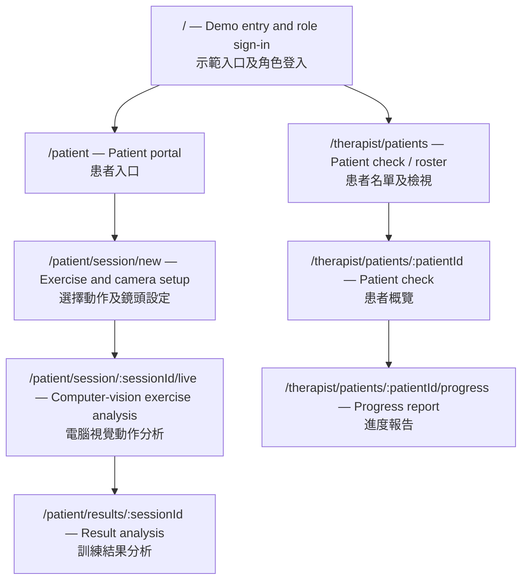
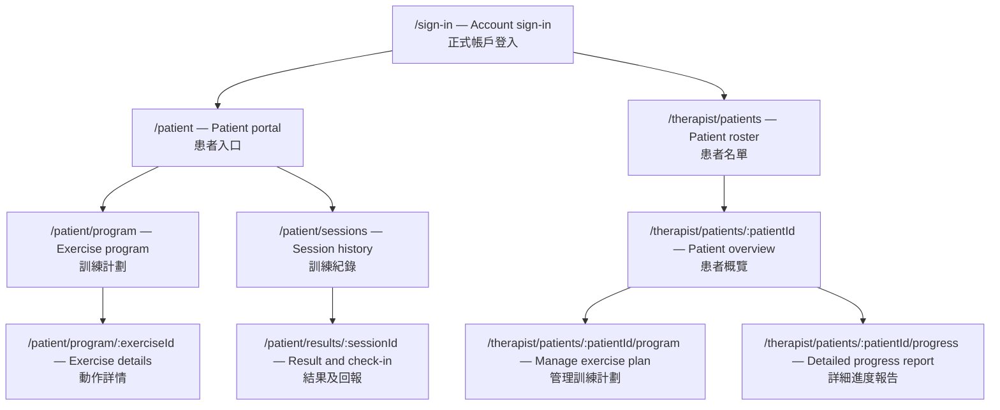
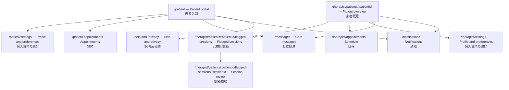

# PhysioCare — Phased Sitemap / 分階段網站地圖

## Goal / 目標

Keep the hackathon build focused on one complete care loop: a patient completes a camera-guided exercise, reviews the result, and a physiotherapist checks the patient and their progress. Reuse and extend the existing squat-analysis demo as the Phase 1 exercise-analysis experience.

黑客松版本聚焦於一個完整照護流程：患者完成鏡頭動作分析並檢視結果，物理治療師查看患者及其進度。第一階段沿用並擴充現有深蹲分析示範。

## Phase 1 — Hackathon MVP / 黑客松最小可行產品

### Judge-facing product story / 評審展示主線

Show one continuous care loop—not a collection of screens: **a patient exercises at home → PhysioCare measures movement and captures how the session felt → their physiotherapist sees progress and knows what may need follow-up.** Use one demo patient with a goal and several seeded past sessions so the progress report is meaningful immediately; the live session itself should use the real camera analysis.

展示一個連貫的照護流程，而非一組互不相關的頁面：**患者在家訓練 → PhysioCare 測量動作並記錄訓練感受 → 物理治療師查看進度並了解是否需要跟進。** 使用一位具備訓練目標及數筆預置歷史紀錄的示範患者，讓進度報告一開始便有意義；即時訓練則使用真正的鏡頭分析。

1. **Patient context:** Show the patient's goal, prescribed/demo target, and recent trend before starting. / **患者情境：** 開始前展示患者目標、指定／示範訓練目標及近期趨勢。
2. **Live proof:** Demonstrate on-device pose tracking, rep counting, joint-angle/form feedback, and a safety cue during the exercise. / **即時成果：** 示範裝置端姿勢追蹤、次數計算、關節角度／動作品質回饋及訓練中的安全提示。
3. **Patient outcome:** Show the completed session's measures and a brief pain/discomfort check-in, compared with the seeded baseline. / **患者結果：** 展示本次訓練數據、簡短疼痛／不適回報，以及與預置基準的比較。
4. **Therapist value:** Open the same patient's report to see adherence, movement trends, and flagged sessions that merit human review. / **治療師價值：** 開啟同一患者的報告，查看訓練依從性、動作趨勢及需要人工檢視的已標記訓練。

### Sitemap / 網站地圖

| Page / 頁面 | Phase 1 scope / 第一階段範圍 |
|---|---|
| `/` — Entry / 入口 | Simple demo sign-in or role selection for patient and physiotherapist; send each role to its workspace. / 使用示範登入或角色選擇，並導向相應工作區。 |
| `/patient` — Patient portal / 患者入口 | Show the patient's rehab goal, assigned/demo exercise and target, a recent trend from demo history, and a clear **Start exercise** action. / 顯示患者復健目標、指定／示範動作及目標、示範歷史紀錄的近期趨勢，以及清晰的「開始訓練」操作。 |
| `/patient/session/new` — Setup / 設定 | Select the demo exercise, check camera readiness, and explain that pose processing is on-device and what session metrics are saved. / 選擇示範動作、確認鏡頭就緒，並說明姿勢分析在裝置端進行及會儲存的訓練數據。 |
| `/patient/session/:sessionId/live` — Exercise analysis / 動作分析 | Reuse the squat-analysis demo: on-device camera pose overlay, rep/set count, live joint angles and form/danger feedback, plus pause/finish controls. Show a safety cue for a flagged movement. Save session metrics, not raw video. / 沿用深蹲分析示範：裝置端鏡頭姿勢疊圖、次數／組數、即時關節角度及動作品質／風險回饋，並提供暫停／結束控制；動作被標記時顯示安全提示。儲存訓練數據，不儲存原始影片。 |
| `/patient/results/:sessionId` — Result analysis / 結果分析 | Show completed reps/sets, average form score, maximum danger score, duration, and a brief pain/discomfort check-in. Compare with the seeded baseline or previous sessions. Explain that measures support therapist review and are not diagnosis. / 顯示完成次數／組數、平均動作品質分數、最高風險分數、訓練時間及簡短疼痛／不適回報；與預置基準或過往訓練比較。說明數據供治療師檢視參考，並非診斷。 |
| `/therapist/patients` — Patient check / 患者檢視 | A small patient list with name and latest activity; open a patient record. Seeded/demo data is acceptable for the hackathon. / 精簡患者名單，顯示姓名及最近活動，並可開啟患者資料；黑客松可使用預置／示範資料。 |
| `/therapist/patients/:patientId` — Patient overview / 患者概覽 | Show the patient's goal, latest session, current status, and any flagged item; link directly to the progress report. / 顯示患者目標、最近一次訓練、目前狀態及已標記事項，並直接連結至進度報告。 |
| `/therapist/patients/:patientId/progress` — Progress report / 進度報告 | Show session adherence, history, form/danger trends, pain check-ins, total reps, and flagged sessions. Highlight a follow-up signal without making an automated clinical decision. / 顯示訓練依從性、歷史紀錄、動作品質／風險趨勢、疼痛回報、總次數及已標記訓練。指出跟進訊號，但不自動作出臨床決定。 |

### Phase 1 essentials / 第一階段必要配套

- Keep patient and physiotherapist views role-aware, including basic demo access boundaries.
- Seed one demo patient with a goal and several historical sessions, so the patient view and therapist report tell a progress story on first load.
- Persist session date, exercise, reps/sets, average form score, maximum danger score, duration, pain check-in, and flagged status for the result and report views.
- Handle camera permission/unavailable states and provide a clear restart or exit path.
- Keep feedback informational and safety-oriented; do not present it as diagnosis or prescribe treatment.

第一階段亦須具備：按角色顯示工作區及基本示範存取界線；預置一位具備目標及數筆歷史訓練的患者，讓患者頁面與治療師報告一開始便能呈現進度；儲存訓練日期、動作、次數／組數、平均動作品質分數、最高風險分數、訓練時間、疼痛回報及標記狀態；處理鏡頭權限與無法使用狀態，並提供重新開始或離開方式；回饋僅作資訊及安全提示，不作診斷或治療處方。

## Hackathon boundary / 黑客松範圍界線

Only Phase 1 is in scope for the hackathon. Phase 2 and Phase 3 are marked **（非現階段）** throughout this sitemap. Phase 1 may use seeded users and a small fixed exercise set while preserving routes that can grow into the later phases.

黑客松只實作第一階段。本網站地圖中的第二及第三階段均標記為 **（非現階段）**。第一階段可使用預置使用者及少量固定動作，同時保留可延伸至後續階段的頁面路徑。

**The following phases are out of scope**
===

## Phase 2 — Core product（非現階段） / 核心產品（非現階段）

**非現階段：** These routes and capabilities are future work; they are not part of the hackathon MVP.

**非現階段：** 以下頁面及功能屬於後續開發，不納入黑客松最小可行產品。

### Sitemap / 網站地圖（非現階段）

| Page / 頁面 | Phase 2 scope / 第二階段範圍（非現階段） |
|---|---|
| `/sign-in` — Account sign-in / 帳戶登入 | Authenticate patients and physiotherapists, apply role-based access, and route each person to the correct workspace. / 驗證患者及物理治療師身份、套用角色權限，並導向相應工作區。 |
| `/patient/program` — Exercise program / 訓練計劃 | List the patient's prescribed exercises, targets, status, and therapist instructions. / 列出患者已安排的動作、目標、狀態及治療師指示。 |
| `/patient/program/:exerciseId` — Exercise details / 動作詳情 | Show step-by-step instructions, target sets/reps, safety notes, and the action to start the exercise. / 顯示分步指引、組數／次數目標、安全注意事項及開始訓練操作。 |
| `/patient/sessions` — Session history / 訓練紀錄 | Browse completed sessions by date and exercise, and open an individual result. / 按日期及動作瀏覽已完成訓練，並開啟單次結果。 |
| `/patient/results/:sessionId` — Result and check-in / 結果及回報 | Extend Phase 1 results with structured follow-up questions and longer-term pain/discomfort patterns across multiple sessions. / 在第一階段結果上加入結構化後續問題及多次訓練的長期疼痛／不適模式。 |
| `/therapist/patients/:patientId/program` — Manage exercise plan / 管理訓練計劃 | Create or update the patient's prescribed exercises, targets, instructions, and active status. / 建立或更新患者訓練動作、目標、指示及啟用狀態。 |
| `/therapist/patients/:patientId/progress` — Detailed progress report / 詳細進度報告 | Review longer-term session history and trends by exercise, with available measures and check-ins. / 按動作檢視較長期訓練紀錄、趨勢、可用指標及患者回報。 |

### Phase 2 essentials / 第二階段必要配套（非現階段）

- Link each patient account to authorized physiotherapists and prevent cross-patient data access.
- Persist and validate therapist-managed exercise prescriptions and patient check-ins.
- Support multiple exercises with configurable targets while keeping results comparable over time.

建立患者帳戶與獲授權治療師的連結並防止跨患者存取；儲存及驗證治療師安排的訓練與患者回報；支援多種動作及可調目標，同時維持跨時期結果的可比較性。

## Phase 3 — Extras（非現階段） / 延伸功能（非現階段）

**非現階段：** These optional routes and capabilities follow the core product and are not part of the hackathon MVP.

**非現階段：** 以下延伸頁面及功能須待核心產品完成後再考慮，不納入黑客松最小可行產品。

### Sitemap / 網站地圖（非現階段）

| Page / 頁面 | Phase 3 scope / 第三階段範圍（非現階段） |
|---|---|
| `/therapist/patients/:patientId/flagged-sessions` — Flagged sessions / 已標記訓練 | List sessions flagged for follow-up, with date, exercise, and reason for review. / 列出需要跟進的訓練，顯示日期、動作及檢視原因。 |
| `/therapist/patients/:patientId/flagged-sessions/:sessionId` — Session review / 訓練檢視 | Review session measures and, only if a consented and privacy-reviewed capture workflow exists, a short video clip. / 檢視訓練數據；只有在具備同意及私隱審查流程後，才可檢視短片。 |
| `/patient/settings` and `/therapist/settings` — Profile and preferences / 個人資料及偏好 | Manage account details and communication/display preferences. / 管理帳戶資料及通訊／顯示偏好。 |
| `/patient/appointments` and `/therapist/appointments` — Appointments / 預約 | View or manage appointment availability and scheduled visits. / 查看或管理可預約時段及已安排會面。 |
| `/messages` — Care messages / 照護訊息 | Provide asynchronous communication between a patient and their linked physiotherapist. / 提供患者與已連結治療師之間的非即時訊息功能。 |
| `/notifications` — Notifications / 通知 | Show reminders and updates related to sessions, plans, or appointments. / 顯示訓練、計劃或預約的提醒及更新。 |
| `/help` and `/privacy` — Help and privacy / 說明及私隱 | Offer product guidance, camera troubleshooting, and expanded data/privacy explanations. / 提供產品指引、鏡頭疑難排解及更完整的資料／私隱說明。 |
| Progress report actions — Export and advanced analytics / 進度報告操作：匯出及進階分析 | Add report export and richer analysis when data quality and clinical review workflows support them. / 待數據品質及臨床檢視流程成熟後，加入報告匯出及進階分析。 |

### Phase 3 essentials / 第三階段必要配套（非現階段）

- Review privacy, consent, retention, and access controls before storing or showing any video.
- Define notification, appointment, and message ownership and delivery behavior.
- Keep exports and analytics traceable to source sessions and explain their measurement limitations.

儲存或展示影片前，先審查私隱、同意、保存期限及存取控制；明確定義通知、預約及訊息的負責方與傳送方式；匯出及分析須可追溯至來源訓練，並說明測量限制。

