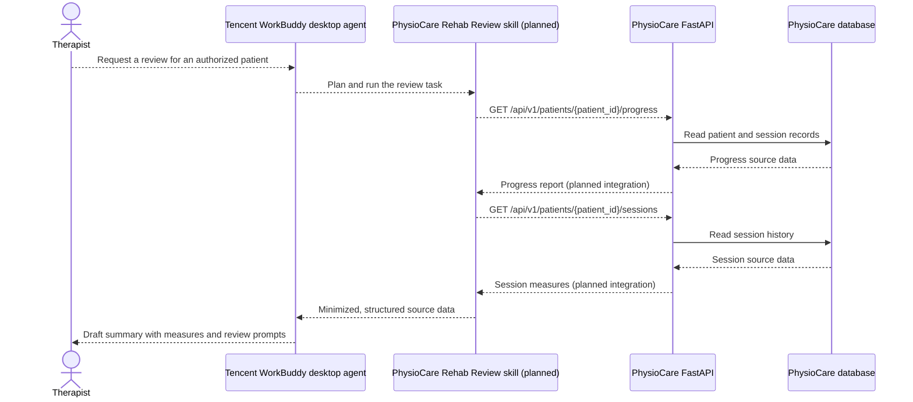

# Tencent WorkBuddy Integration Proposal

## Executive Summary / 執行摘要

**English:** PhysioCare can demonstrate Tencent WorkBuddy as a therapist-facing Rehab Review Agent, rather than as a generic patient chatbot. For the hackathon, a custom WorkBuddy skill can use a local, seeded demo patient and read session data from the existing PhysioCare API to prepare a source-grounded report. This demonstrates WorkBuddy's task planning, tool use, and deliverable-generation strengths without waiting for production-readiness gates. The integration is proposed, not implemented; public documentation reviewed describes a desktop workflow and custom skills, but does not establish an embeddable SDK. Real patient data would require authentication, patient-level authorization, and data-minimization controls. WorkBuddy drafts summaries only; clinical decisions remain with the therapist.

**繁體中文：** PhysioCare 可將騰訊 WorkBuddy 示範為面向物理治療師的「復健檢視助理」，而非一般患者聊天機械人。黑客松期間，可透過自訂 WorkBuddy Skill 使用本機預置的示範患者，並從現有 PhysioCare API 讀取訓練資料，產生附有數據依據的報告。這能展示 WorkBuddy 的任務規劃、工具操作及文件產出能力，毋須等待正式產品化前置關卡。目前這仍是整合方案，尚未實作；已查閱的公開文件介紹桌面工作流程及自訂 Skill，但未能確認可嵌入應用程式的 SDK。使用真實患者資料則必須先具備身份驗證、患者資料存取權限及資料最少化措施。WorkBuddy 只負責草擬摘要，臨床決定仍由治療師作出。

## What is Tencent WorkBuddy? / 騰訊 WorkBuddy 是甚麼？

Tencent WorkBuddy is an AI agent desktop workbench, not just a chat window. A user gives it a task in natural language; it can plan steps, use tools and custom skills, process content, and produce a deliverable. For PhysioCare, the relevant capability is using a custom skill to retrieve existing exercise-session data and create a therapist-facing review draft. WorkBuddy currently is not embedded in the PhysioCare app.

**繁體中文：** 騰訊 WorkBuddy 是桌面 AI Agent 工作台，不只是聊天介面。使用者以自然語言交代任務後，它可以規劃步驟、操作工具及自訂 Skill、處理內容，並產出可供使用的成果。對 PhysioCare 而言，最相關的能力是透過自訂 Skill 讀取現有訓練資料，並整理成供治療師檢視的摘要。目前 WorkBuddy 並未嵌入 PhysioCare 應用程式。

## Recommended use case

A therapist asks WorkBuddy to review one patient's progress. A PhysioCare-specific custom skill retrieves that patient's authorized progress and session data, then prepares a concise, source-grounded report with:

- Session count, completed reps, average form score, and average danger score.
- Available trend and flagged-session counts.
- Recent session measures and patient-reported pain scores.
- Follow-up questions or items for the therapist to review.

The result is a **draft for therapist review**, not a diagnosis, exercise prescription, or autonomous treatment decision. For a compelling demo, use a seeded patient and ask WorkBuddy to summarize that patient's available sessions and highlight what merits human review.

## Hackathon proof of capability / 黑客松功能示範

The goal is to show that WorkBuddy can complete one useful PhysioCare task—not to finish a production integration. No previous approval or readiness gates are required for this prototype. Use a local backend and seeded demo records only.

**Demo flow:**

1. Start the PhysioCare backend with demo patient/session data.
2. Create a small WorkBuddy custom skill that reads the demo patient's existing progress and session endpoints.
3. In WorkBuddy, request: *“Review this demo patient's exercise progress and prepare a therapist summary.”*
4. Show the generated report beside the API's source measures, and confirm that the therapist remains responsible for review.

This is a WorkBuddy-assisted workflow demonstrated alongside PhysioCare; it does not claim that WorkBuddy is embedded in the web app. Keep the skill read-only, avoid webcam video, and do not use real patient information in the hackathon demo.

**繁體中文：** 示範目標是證明 WorkBuddy 能完成一項對 PhysioCare 有用的任務，而非完成正式產品整合。此原型毋須先通過其他審批或就緒關卡；只使用本機後端及預置示範資料。

**示範流程：**

1. 啟動載有示範患者及訓練紀錄的 PhysioCare 後端。
2. 建立簡單的 WorkBuddy 自訂 Skill，讀取該示範患者現有的進度及訓練 API。
3. 在 WorkBuddy 輸入：「檢視這位示範患者的訓練進度，並整理一份治療師摘要。」
4. 將產生的報告與 API 原始數據並列展示，並說明摘要仍由治療師審閱。

這是與 PhysioCare 配合展示的 WorkBuddy 工作流程，並不代表 WorkBuddy 已嵌入網站。Skill 維持唯讀，不傳送鏡頭影片，黑客松示範亦不使用真實患者資料。

## Proposed relationship to PhysioCare

Dashed arrows show the proposed integration; solid arrows show the current API-to-database read flow.

| Component | Responsibility | Status |
|---|---|---|
| `backend/app/api/endpoints.py` | Provides patient progress and session-history endpoints under `/api/v1`. | Existing |
| `backend/app/schemas/schemas.py` | Defines the progress and session response fields available to a review workflow. | Existing |
| `backend/app/models/models.py` | Stores patient, prescribed exercise, session, and flagged-clip records. | Existing |
| PhysioCare Rehab Review custom skill | Calls only approved PhysioCare API operations, minimizes the returned fields, and supplies evidence to the agent. | Planned |
| Tencent WorkBuddy | Plans the review task and generates the therapist-facing draft. | External product; not embedded in PhysioCare |
| Therapist | Checks source measures and decides whether follow-up is needed. | Human-in-the-loop |

## Integration approach and boundary

WorkBuddy's public documentation describes a desktop agent, custom skills, and connectors. The documented custom-skill pattern uses skill metadata plus implementation files (such as scripts or tools). For the hackathon prototype, the skill can call the locally running PhysioCare API using a fixed demo patient. A production deployment would require HTTPS, a narrowly scoped service credential, and verified therapist/patient authorization.

The documentation reviewed does not describe an SDK for embedding WorkBuddy's agent runtime inside a Next.js app. Therefore, the initial integration should be treated as a **WorkBuddy-to-PhysioCare workflow**, with WorkBuddy producing a report for the therapist. If an in-app assistant is later required, assess a supported WorkBuddy API separately; do not assume the desktop product can be embedded.

## Privacy, authorization, and clinical boundaries

- The current API handlers in `backend/app/api/endpoints.py` do not show therapist authentication or patient-level authorization dependencies. Add and verify those controls before allowing an external agent to retrieve real patient records.
- Restrict the skill to read-only progress and session endpoints, and enforce that the requesting therapist is authorized for the requested patient.
- Send only the data needed for the summary. Do not send webcam video or flagged clips to WorkBuddy; PhysioCare's pose processing is designed to remain on-device.
- Treat agent-written explanations as drafts. Display the underlying session measures and dates so a therapist can verify the summary.
- Keep report generation separate from clinical actions: WorkBuddy must not alter prescriptions, mark a patient as diagnosed, or make treatment decisions.
- Use demo data for hackathon demonstrations. Review consent, data handling, retention, and applicable privacy requirements before using real patient data with an external service.

## Hackathon implementation scope

For the time-limited hackathon, prioritize the smallest end-to-end proof: one seeded patient, read-only API access, one custom skill, and one reviewable report. Authentication hardening and real-patient deployment are follow-up production work, not prerequisites for this demo.

The current session-history endpoint returns all sessions and does not accept a date-range parameter. A bounded review period (for example, the last four weeks) would require adding server-side date filtering or applying a carefully bounded filter in the skill.

## References

- [Tencent Cloud — WorkBuddy](https://www.tencentcloud.com/products/workbuddy): product overview and agent capabilities.
- [WorkBuddy — Overview](https://www.workbuddy.ai/docs/workbuddy/Overview): desktop-agent capabilities and use cases.
- [WorkBuddy — Creating Custom Skills](https://www.workbuddy.ai/docs/workbuddy/From-Beginner-to-Expert-Guide/Practice-Cases/Create-Skills): custom skill structure and workflow.
- [WorkBuddy — Skill Marketplace](https://www.workbuddy.ai/docs/workbuddy/From-Beginner-to-Expert-Guide/Function-Description/Skills-Market): extending WorkBuddy with skills.
